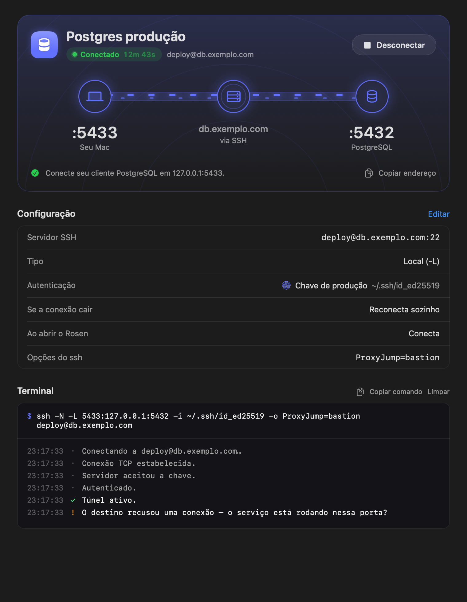
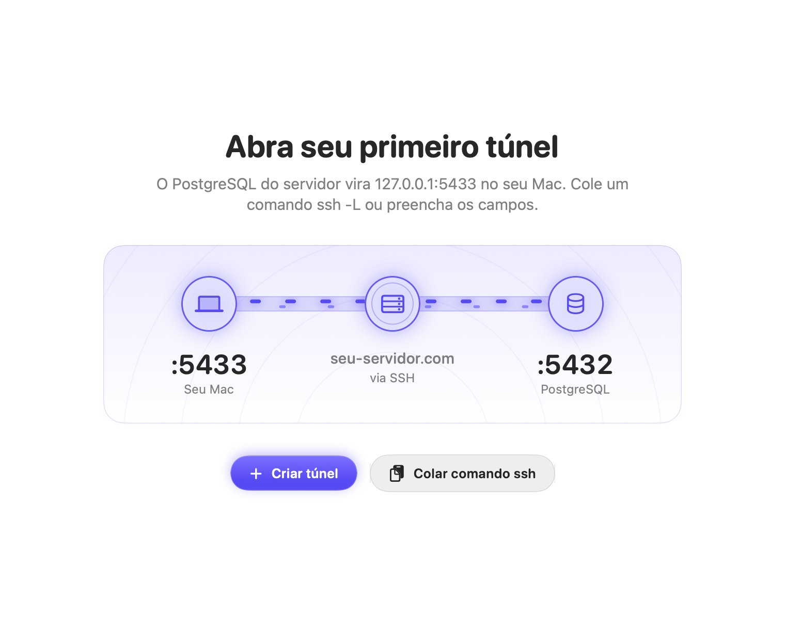
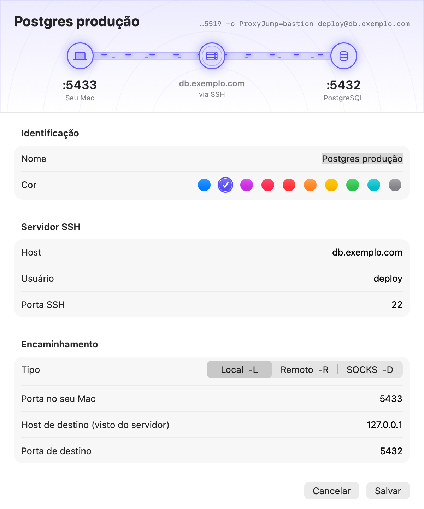
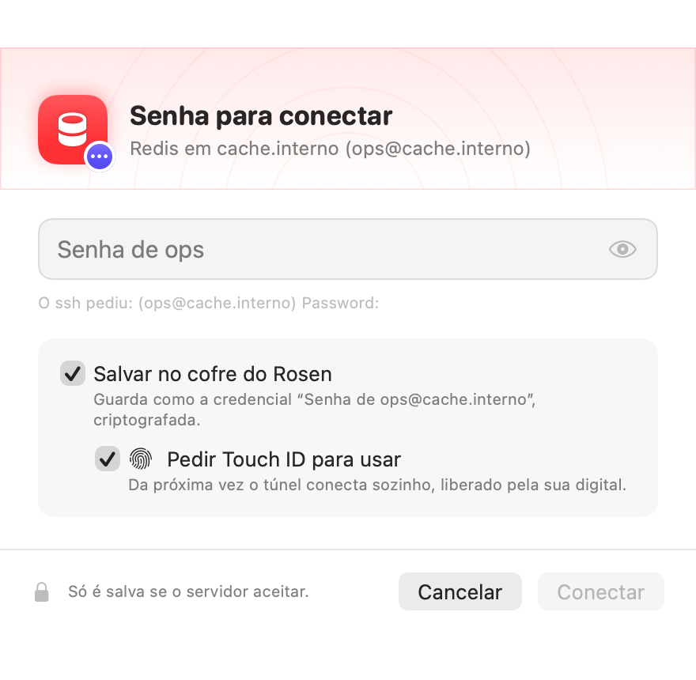
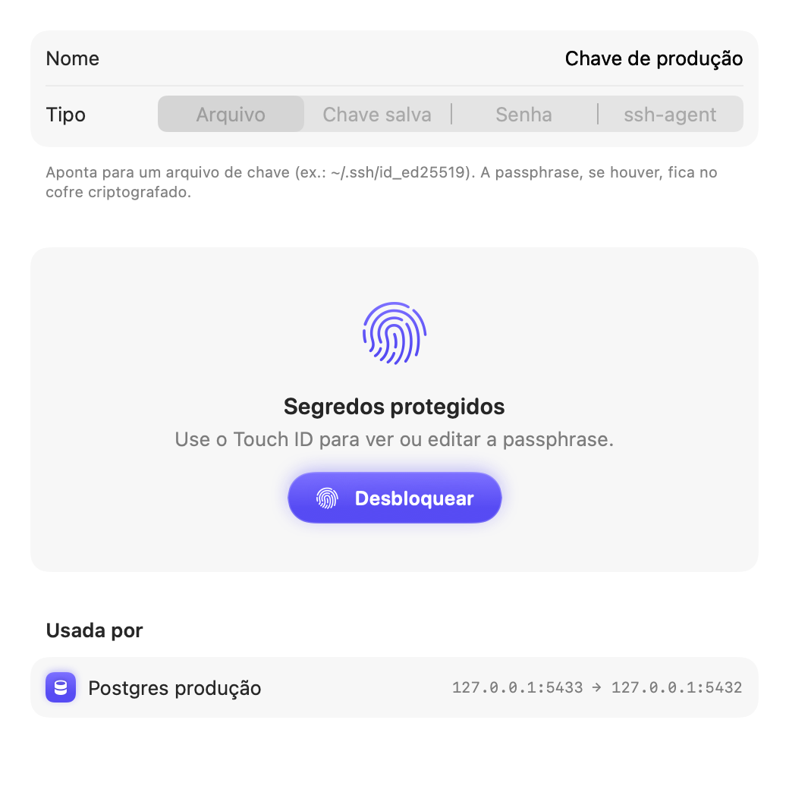
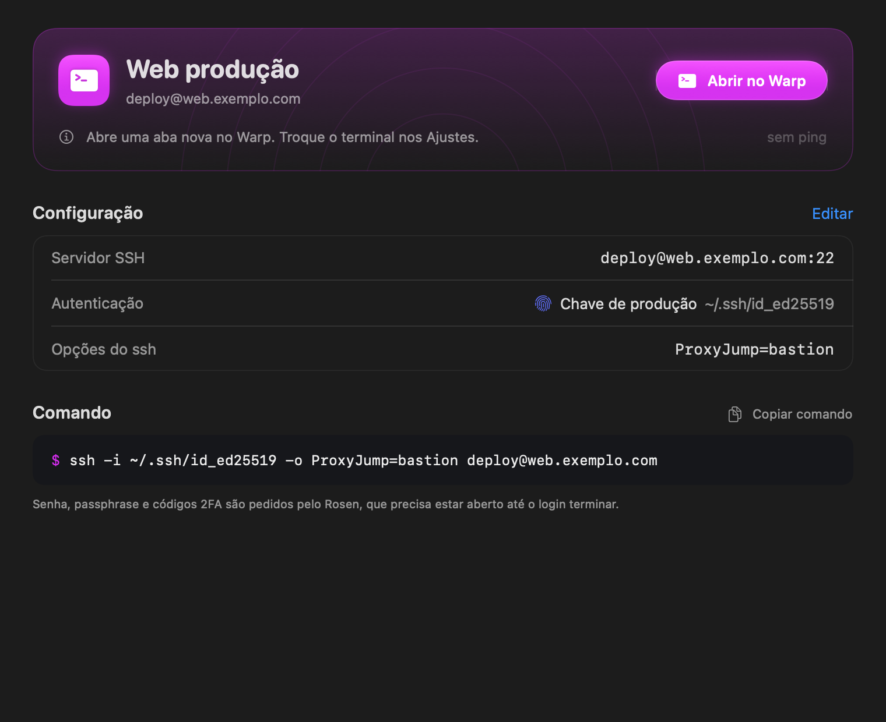

<p align="center">
  
</p>

<h1 align="center">Rosen</h1>

<p align="center">
  Túneis e acessos SSH, nativo para macOS.<br>
  Seus bancos remotos no <code>127.0.0.1</code> com um interruptor, e seus servidores a um clique do terminal.
</p>

<p align="center">
  <a href="https://github.com/bellinivitor/rosen/releases"></a>
  
  
  <a href="https://buymeacoffee.com/vitorbellini"></a>
</p>

<p align="center">
  
</p>

Em vez de deixar um terminal aberto com

```bash
ssh -N -L 5433:127.0.0.1:5432 usuario@seu-servidor.com
```

você cola esse comando no Rosen uma vez e, dali em diante, liga e desliga o túnel com um clique, pela janela ou pela barra de menus. Ele reconecta sozinho, avisa quando algo dá errado em português claro e guarda chaves e senhas num cofre criptografado, liberado pelo Touch ID.

E para entrar no servidor, em vez de lembrar `ssh -p 2222 -J bastion deploy@...`, você clica em **Abrir no Warp** (ou no Terminal) e o Rosen entrega a senha ao `ssh`, direto do mesmo cofre.

> **Versão beta.** O Rosen funciona no dia a dia, mas ainda pode ter arestas. Se algo estranho acontecer, [abra uma issue](https://github.com/bellinivitor/rosen/issues).

## Instalação

Com o [Homebrew](https://brew.sh):

```bash
brew install --cask bellinivitor/rosen/rosen
```

Ou baixe o `.zip` na [página de releases](https://github.com/bellinivitor/rosen/releases) e arraste o `Rosen.app` para a pasta Aplicativos.

**Primeira abertura:** o app ainda não é assinado com um certificado de desenvolvedor Apple, então o macOS bloqueia na primeira vez. Libere com:

```bash
xattr -dr com.apple.quarantine /Applications/Rosen.app
```

Requer macOS 14 (Sonoma) ou mais recente. Funciona em Macs com Apple Silicon e Intel.

## O que ele faz

<table>
  <tr>
    <td width="50%"></td>
    <td width="50%"></td>
  </tr>
  <tr>
    <td><b>Cole um comando <code>ssh</code></b> e o formulário se preenche sozinho: portas, usuário, <code>-p</code>, <code>-i</code>, <code>-J</code>, <code>-o</code>. <code>⇧⌘V</code> cria o túnel direto do clipboard.</td>
    <td><b>Prévia ao vivo</b> enquanto você edita. A porta local é sugerida sozinha (5432 → 5433) e sempre livre.</td>
  </tr>
  <tr>
    <td></td>
    <td></td>
  </tr>
  <tr>
    <td><b>Pergunta na hora</b> quando o servidor pede senha, passphrase ou código 2FA, e oferece salvar no cofre. Só salva depois que o servidor aceita.</td>
    <td><b>Touch ID</b> para usar ou ver uma credencial. Sem sensor disponível, pede a senha do Mac.</td>
  </tr>
</table>

- **Credenciais reutilizáveis**: arquivo de chave, chave guardada no cofre, senha ou ssh-agent. Uma credencial serve para vários túneis e servidores.
- **Barra de menus**: liga e desliga túneis e abre servidores sem abrir a janela.

### Túneis

- **Quantos você quiser**: Local (`-L`), Remoto (`-R`) e proxy SOCKS (`-D`).
- **Reconexão automática**, com espera crescente (1 s até 30 s). Reconecta quando a rede volta e quando o Mac acorda.
- **Erros que dá para entender**: "a porta 5433 já está em uso por postgres", "autenticação recusada", "a identidade do servidor mudou".
- **Latência ao vivo**: com o túnel conectado, o Rosen mede o ping até o servidor a cada 5 s e mostra o valor e um mini gráfico. Usa ICMP, então não gera logs de login no servidor.
- **Terminal embutido** em cada túnel: o comando `ssh` equivalente e a saída da conexão.

### Servidores

<p align="center">
  
</p>

O Rosen guarda os servidores que você acessa por SSH e abre cada um numa aba nova do seu terminal, com o `ssh` já rodando.

- **Warp ou Terminal**: escolha nos Ajustes.
- **Login sem digitar**: com a senha ou passphrase salva, o Rosen a entrega ao `ssh` pelo askpass (com Touch ID, se a credencial exigir). O que não estiver salvo, como um código 2FA, ele pergunta no próprio painel. Com ssh-agent, o `ssh` roda como de costume e pergunta no terminal.
- **Cole um comando** `ssh -p 2222 -J bastion user@host` e o formulário se preenche.
- **Importe do `~/.ssh/config`**: cada `Host` vira um servidor que usa o próprio alias, então o `ssh` continua lendo HostName, chave e ProxyJump do seu config.
- **Latência** no detalhe do servidor, por ping.
- **Túnel a partir de um servidor**, sem redigitar host, porta e credencial.

### Atalhos

| Ação | Atalho |
|---|---|
| Novo túnel | `⌘N` |
| Novo servidor | `⌥⌘N` |
| Novo a partir do clipboard | `⇧⌘V` |
| Conectar ou desconectar o túnel / abrir o servidor no terminal | `⌘R` |
| Editar / duplicar | `⌘E` / `⌘D` |
| Copiar endereço local / comando | `⌥⌘C` / `⇧⌘C` |
| Conectar todos / desconectar todos | `⇧⌘R` / `⇧⌘.` |
| Credenciais | `⇧⌘K` |
| Bloquear credenciais | `⇧⌘L` |
| Excluir | `⌫` na lista |

## Segurança

O Rosen usa o `ssh` do próprio macOS (`/usr/bin/ssh`) e nunca envia nada para fora do seu Mac.

- **Cofre criptografado.** Túneis, servidores e credenciais ficam num único arquivo (`~/Library/Application Support/Rosen/vault.rosen`, permissão `0600`) cifrado com AES-256-GCM. Qualquer alteração no arquivo o invalida.
- **Chave no Keychain.** A chave do cofre é aleatória (256 bits) e fica no Keychain com `WhenUnlockedThisDeviceOnly`: não sai deste Mac nem vai para backups do iCloud.
- **Segredos fora do alcance.** Senhas e passphrases chegam ao `ssh` por dois FIFOs privados (pedido e resposta), nunca por argumento de linha de comando, variável de ambiente ou arquivo. Confirmações `yes/no` são sempre recusadas.
- **Chaves temporárias.** Uma chave guardada no cofre é gravada num diretório privado só durante o login, depois sobrescrita e apagada.
- **Touch ID.** Credenciais com segredo guardado podem exigir Touch ID (ou a senha do Mac) para conectar e para mostrar os segredos. O desbloqueio vale pelo tempo escolhido nos Ajustes e é revogado quando o Mac bloqueia ou dorme.
- **Sessões no terminal.** O terminal executa um script `.command` (permissão `0700`) num diretório privado. O script não contém segredos, só os argumentos do `ssh` e os caminhos dos FIFOs, e se apaga ao iniciar. O Rosen escuta os pedidos de senha por até 2 minutos depois do último e então apaga o diretório; uma chave guardada no cofre sai do disco cerca de 20 s após o último pedido respondido. Se o Rosen for fechado antes do login, o `ssh` pergunta no próprio terminal.
- **Hosts.** Um servidor novo é aceito na primeira conexão (`StrictHostKeyChecking=accept-new`). Se a identidade dele mudar depois, a conexão é recusada.

## Limitações da beta

- **Sem assinatura Apple.** Daí o comando `xattr` na primeira abertura. Pelo mesmo motivo, o macOS pode pedir de novo acesso à chave do cofre depois de uma atualização: clique em **Permitir sempre**.
- **O Touch ID é uma trava do app.** O cofre é criptografado, mas a chave dele no Keychain não depende da biometria. Amarrar as duas exige assinatura com Developer ID, prevista para quando o app for assinado.
- **Terminais.** Por enquanto, Warp e o Terminal do macOS.
- **Interface só em português.**

## Desenvolvimento

Requisitos: macOS 14+ e Command Line Tools (`xcode-select --install`). Não precisa do Xcode.

```bash
make test       # testes do núcleo (Swift Testing)
make run        # build debug e abre o app
make snapshot   # renderiza as telas em build/snapshots, para revisão visual
make install    # build release e copia para /Applications
```

O build usa `swiftc` direto (`Scripts/build.sh`). O `Package.swift` também está no repositório, para abrir no Xcode ou usar `swift build` onde o SwiftPM funcionar.

```
Sources/RosenCore   modelos, parsers (comando ssh e ~/.ssh/config), cofre, logs do ssh, askpass, script de terminal, portas
Sources/Rosen       app SwiftUI: sessões ssh, store, telas
Tests/              testes do núcleo
Scripts/            build, release, ícone e capturas de tela
Casks/rosen.rb      fonte do Cask (publicado no tap bellinivitor/homebrew-rosen)
```

### Publicar uma versão

```bash
make release V=0.2.0
```

Isso gera `dist/Rosen-0.2.0.zip` (arm64 + x86_64) e grava versão e sha256 em `Casks/rosen.rb`. Depois:

```bash
git commit -am "chore: release 0.2.0" && git push
gh release create v0.2.0 dist/Rosen-0.2.0.zip
Scripts/release.sh --tap    # publica o Cask no tap bellinivitor/homebrew-rosen
```

O `--tap` precisa de um clone do tap em `../homebrew-rosen` (`gh repo clone bellinivitor/homebrew-rosen ../homebrew-rosen`) e vem por último: o Cask aponta para o zip da release.

Com uma conta de desenvolvedor Apple, assine e notarize:

```bash
SIGN_IDENTITY="Developer ID Application: Seu Nome (TEAMID)" make release V=0.2.0
xcrun notarytool submit dist/Rosen-0.2.0.zip --keychain-profile rosen --wait
```

## Por que "Rosen"

Vem da ponte de Einstein-Rosen, o "buraco de minhoca": um atalho que liga dois pontos distantes do espaço como se estivessem lado a lado. É o que um túnel SSH faz com um banco remoto.

## Apoie

Se este projeto te ajudou, você pode me pagar um café ☕

<a href="https://buymeacoffee.com/vitorbellini"></a>
